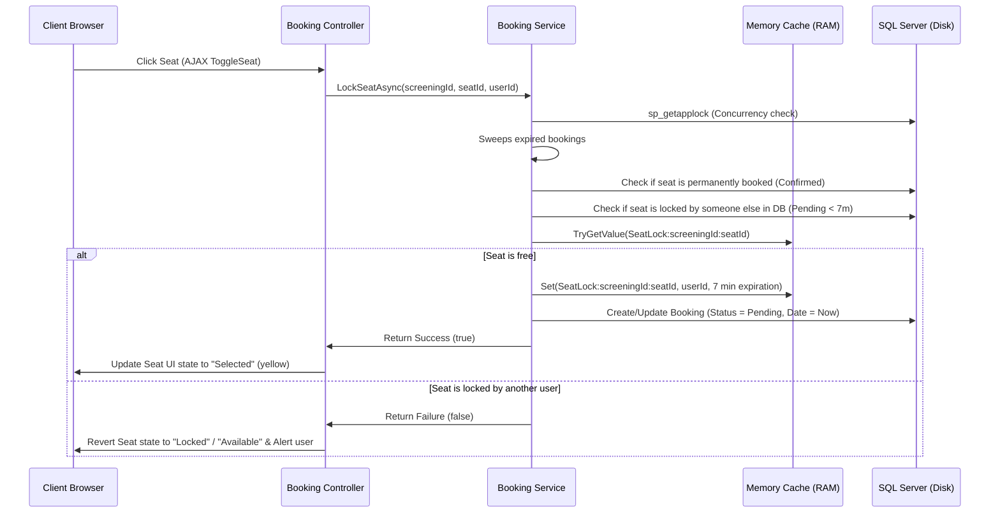

# CemaApp Developer & Architecture Guide

Welcome to the **CemaApp** codebase guide! This document is designed for developers who are new to this technology stack. It provides a complete conceptual explanation, details the project file structure (covering every single file), explains how the request/response flows work, and shows exactly how the **caching mechanism** and the **7-minute seat-locking limit** are implemented and where to find them.

---

## 1. Introduction to the Technology Stack

**CemaApp** is a web-based Cinema Ticket Booking system built using the **Microsoft .NET Core** ecosystem. Here is an overview of the technologies used and how they work together:

1. **C# (C-Sharp)**: The modern, type-safe programming language used for the backend logic.
2. **.NET 8.0**: The cross-platform framework used to host, compile, and execute the backend application.
3. **ASP.NET Core MVC (Model-View-Controller)**: The architectural framework used to structure the web application:
   * **Model**: Represents the database entities and view-models.
   * **View**: The HTML templates rendered to the user, integrated with C# code using **Razor Engine** (`.cshtml` files).
   * **Controller**: The entry points that receive HTTP requests (like page loads, button clicks, API calls), call backend services, and return views or JSON responses.
4. **Entity Framework Core (EF Core)**: An Object-Relational Mapper (ORM). It allows developers to query and manipulate the database using C# objects instead of writing raw SQL. It maps C# classes directly to SQL Server database tables.
5. **SQL Server Database**: The relational database used to store permanent records (Movies, Halls, Seats, Screenings, Bookings, Users, and Roles).
6. **ASP.NET Core Identity**: The secure membership system built into .NET to handle user registration, logins, passwords (which are hashed automatically), and role-based authorization (e.g., separating standard `User` functions from `Admin` panels).
7. **IMemoryCache (In-Memory Caching)**: A high-performance, key-value storage system residing in the server's RAM. It is used in this project to store temporary "seat locks" instantly without slow database writing overhead.
8. **Client-Side Stack (HTML5, Bootstrap CSS, JavaScript/jQuery, AJAX)**:
   * **Bootstrap**: Extensively used for responsive layout and styling.
   * **AJAX (Asynchronous JavaScript and XML)**: Enables the webpage to communicate with the backend server silently in the background (like locking a seat or checking seat updates every 2 seconds) without needing to reload the entire web page.
   * **JavaScript Polling & Timer**: Implements a live 7-minute countdown clock and periodic grid refreshes.

---

## 2. Global Directory & File Map

Below is a file-by-file breakdown of the entire **CemaApp** codebase:

### Root Directory
* **[CemaApp.csproj](file:///d:/hola/belal/SU/s6/wdt_project/final/CemaApp/CemaApp.csproj)**: The project configuration file. Defines the target framework (`net8.0`), compilation options, and external NuGet dependencies (like EF Core and Identity).
* **[Program.cs](file:///d:/hola/belal/SU/s6/wdt_project/final/CemaApp/Program.cs)**: The starting entry point of the entire application. It:
  * Configures the Database Connection (`AddDbContext`).
  * Registers ASP.NET Core Identity (`AddIdentity`).
  * Configures application cookies (paths for Login, Access Denied, and expiration).
  * Registers backend services (like `AddMemoryCache` and `IBookingService`).
  * Configures the middleware pipeline (routing, HTTPS redirection, authentication, authorization, and static files).
  * Triggers database seeding on launch.
* **[data.json](file:///d:/hola/belal/SU/s6/wdt_project/final/CemaApp/data.json)**: A local dataset containing raw movie information fetched from The Movie Database (TMDb) API. Used to populate the database with realistic sample movies during seeding.
* **[appsettings.json](file:///d:/hola/belal/SU/s6/wdt_project/final/CemaApp/appsettings.json)**: Contains environment configuration options. This holds the active **SQL Server connection string** pointing to the database.
* **[appsettings.Development.json](file:///d:/hola/belal/SU/s6/wdt_project/final/CemaApp/appsettings.Development.json)**: Contains configurations specifically active when running in local development mode.

---

### Data & Migrations
* **[Data/DbSeeder.cs](file:///d:/hola/belal/SU/s6/wdt_project/final/CemaApp/Data/DbSeeder.cs)**: Handles seeding the database. On first boot, it:
  1. Creates roles (`Admin` and `User`).
  2. Spawns an administrator account (`admin@cema.com`).
  3. Spawns test user accounts.
  4. Generates cinema halls (`IMAX 1`, `Standard 2`, `VIP Lounge`) along with a full grid of physical seats.
  5. Parses `data.json` to seed movies with descriptions, posters, and dummy trailer links.
  6. Creates random movie screenings (showtimes) and dummy booking histories.
* **[Migrations/](file:///d:/hola/belal/SU/s6/wdt_project/final/CemaApp/Migrations)**: Auto-generated C# files created by EF Core. They track history and apply changes to the SQL Server database schema as models evolve.

---

### Models (Core Entities)
These C# classes map directly to SQL Server database tables.
* **[Models/AppDbContext.cs](file:///d:/hola/belal/SU/s6/wdt_project/final/CemaApp/Models/AppDbContext.cs)**: The EF Core database context. Configures the database tables, defines model relationships (one-to-many, cascading deletes), and instructs EF how decimal values (like prices) and keys are stored.
* **[Models/ApplicationUser.cs](file:///d:/hola/belal/SU/s6/wdt_project/final/CemaApp/Models/ApplicationUser.cs)**: Represents a registered user. Inherits from identity's `IdentityUser` (providing username, email, phone, password hash) and adds custom properties like `FullName` and `DateOfBirth`.
* **[Models/Movie.cs](file:///d:/hola/belal/SU/s6/wdt_project/final/CemaApp/Models/Movie.cs)**: Represents a movie. Properties include title, description, genre, runtime, release date, poster image file name, trailer URL, and active status.
* **[Models/Hall.cs](file:///d:/hola/belal/SU/s6/wdt_project/final/CemaApp/Models/Hall.cs)**: Represents a physical cinema auditorium. Stores the hall name, grid rows, and seats per row count.
* **[Models/Seat.cs](file:///d:/hola/belal/SU/s6/wdt_project/final/CemaApp/Models/Seat.cs)**: Represents a single seat in a hall (designated by a Row letter like "A" and a seat Number like "5"). Linked to a `Hall`.
* **[Models/Screening.cs](file:///d:/hola/belal/SU/s6/wdt_project/final/CemaApp/Models/Screening.cs)**: Represents a scheduled movie screening. Connects a `Movie` to a `Hall` at a specific date and time (`StartTime`), with a ticket `Price`.
* **[Models/Booking.cs](file:///d:/hola/belal/SU/s6/wdt_project/final/CemaApp/Models/Booking.cs)**: Represents a ticket booking session. Tracks the booking user, the screening, booking timestamp, total price, and the current state via the `BookingStatus` enum:
  * `Pending`: Undergoing seat selection (active countdown holding).
  * `Confirmed`: Successfully purchased tickets.
  * `Cancelled`: Relinquished booking (seats released).
  * `RemovedByUser`: Hidden from the user's personal booking history list.
* **[Models/BookingSeat.cs](file:///d:/hola/belal/SU/s6/wdt_project/final/CemaApp/Models/BookingSeat.cs)**: The association table linking a `Booking` to one or more `Seat` records (resolves the many-to-many relationship).
* **[Models/ErrorViewModel.cs](file:///d:/hola/belal/SU/s6/wdt_project/final/CemaApp/Models/ErrorViewModel.cs)**: Standard model used to display system trace information on application error pages.

---

### ViewModels
Data structures specifically shaped to transfer data between Controllers and Views, decoupling views from database entity validation:
* **[ViewModels/AuthVM.cs](file:///d:/hola/belal/SU/s6/wdt_project/final/CemaApp/ViewModels/AuthVM.cs)**: Bundles validation constraints for `LoginViewModel` (Email, Password, Remember Me) and `RegisterViewModel` (Full Name, Date of Birth with a check to prevent future dates, Email, Password, and Confirmation Password).
* **[ViewModels/MovieBaseViewModel.cs](file:///d:/hola/belal/SU/s6/wdt_project/final/CemaApp/ViewModels/MovieBaseViewModel.cs)**:
  * `MovieBaseViewModel` (Abstract): Holds common fields like title, genre, runtime, and trailer URLs.
  * `MovieCreateViewModel`: Appends a required file property `PosterImage` (`IFormFile`) for raw uploading.
  * `MovieEditViewModel`: Includes ID, active state, existing poster file path, and an optional new upload field `NewPosterImage`.
* **[ViewModels/DashboardViewModel.cs](file:///d:/hola/belal/SU/s6/wdt_project/final/CemaApp/ViewModels/DashboardViewModel.cs)**: Holds administrative metrics (total revenue, confirmed bookings count, customer register count, popular movie details, average cinema capacity occupancy rate, and recent transactions).
* **[ViewModels/AdminBookingListViewModel.cs](file:///d:/hola/belal/SU/s6/wdt_project/final/CemaApp/ViewModels/AdminBookingListViewModel.cs)**: Powers the admin dashboard's transaction viewer, including search queries, filtering parameters, sorting commands, and pagination data (current page, total pages).
* **[ViewModels/UserBookingsViewModel.cs](file:///d:/hola/belal/SU/s6/wdt_project/final/CemaApp/ViewModels/UserBookingsViewModel.cs)**: Binds the logged-in user profile, their active pending bookings, and their past confirmed/cancelled booking history.

---

### Services (Business Logic)
Defines reusable business logic layer interfaces and classes.
* **[Services/IBookingService.cs](file:///d:/hola/belal/SU/s6/wdt_project/final/CemaApp/Services/IBookingService.cs)**: Interface declaring the contract for managing seat locks (`LockSeatAsync`), purchase confirmations (`ConfirmBookingAsync`), fetching screening grids (`GetSeatsWithStatusAsync`), and sweeping expired booking holds (`CleanExpiredPendingBookingsAsync`).
* **[Services/BookingService.cs](file:///d:/hola/belal/SU/s6/wdt_project/final/CemaApp/Services/BookingService.cs)**: The core engine of the seat locking mechanism (see details in the Caching section below).

---

### Controllers (HTTP Endpoints)
* **[Controllers/AccountController.cs](file:///d:/hola/belal/SU/s6/wdt_project/final/CemaApp/Controllers/AccountController.cs)**: Manages authentication. Implements Register (GET/POST), Login (GET/POST with return redirects), Logout (POST), and displays an Access Denied view when a standard user attempts admin routes.
* **[Controllers/BookingController.cs](file:///d:/hola/belal/SU/s6/wdt_project/final/CemaApp/Controllers/BookingController.cs)**: Accessible by logged-in users. Serves the interactive seat reservation layout page and exposes JSON API endpoints (`GetSeats`, `ToggleSeat`, and `ConfirmBooking`) that the javascript code interacts with.
* **[Controllers/BookingsController.cs](file:///d:/hola/belal/SU/s6/wdt_project/final/CemaApp/Controllers/BookingsController.cs)**: Manages user accounts and bookings. Displays the user's booking history and allows users to cancel active bookings or hide cancelled records.
* **[Controllers/DashboardController.cs](file:///d:/hola/belal/SU/s6/wdt_project/final/CemaApp/Controllers/DashboardController.cs)**: Restrictive admin panel controller. Computes system telemetry and houses the administrative database list of bookings.
* **[Controllers/HallsController.cs](file:///d:/hola/belal/SU/s6/wdt_project/final/CemaApp/Controllers/HallsController.cs)**: Admin-restricted route to create cinema halls. When a hall is created, it automatically generates a collection of child seats dynamically.
* **[Controllers/HomeController.cs](file:///d:/hola/belal/SU/s6/wdt_project/final/CemaApp/Controllers/HomeController.cs)**: Renders static pages (Home landing page, privacy policy, "Learn More" informational sheet) and handles global error redirections.
* **[Controllers/MoviesController.cs](file:///d:/hola/belal/SU/s6/wdt_project/final/CemaApp/Controllers/MoviesController.cs)**: Main interface for movie listings. Provides anonymous browsing with paginated search and genre filters. For administrators, it exposes Create, Edit (with image uploads/deletion), and Delete commands.
* **[Controllers/ScreeningsController.cs](file:///d:/hola/belal/SU/s6/wdt_project/final/CemaApp/Controllers/ScreeningsController.cs)**: Admin interface to schedule screenings (assigning movies to halls on specified showtimes with custom pricing).

---

### Views (UI Markup & Client-side Script)
The Razor template (.cshtml) files rendering HTML to users:
* **`Views/Account/`**: Login, Register registration templates, and AccessDenied warning pages.
* **`Views/Booking/`**:
  * **[SelectSeats.cshtml](file:///d:/hola/belal/SU/s6/wdt_project/final/CemaApp/Views/Booking/SelectSeats.cshtml)**: The seating grid visualizer. Features an SVG-styled cinema row system, an interactive legend (Available, Selected, In Progress, Booked), an active ticking countdown clock, and JavaScript logic to perform AJAX operations.
* **`Views/Bookings/`**: Details page for individual ticket reservations, and the Index dashboard listing active/past bookings.
* **`Views/Dashboard/`**: General stats page (charts/telemetry) and the paginated searchable booking history master list.
* **`Views/Halls/`**: Hall listing and creations forms (which prompt for row counts and seats per row).
* **`Views/Home/`**: Main splash landing layouts, learning guides, and privacy rules.
* **`Views/Movies/`**: Search lists, detail descriptions with trailer links, and administrative creation/edit/deletion interfaces.
* **`Views/Screenings/`**: Scheduling listings, screening creation forms, and screening deletion interfaces.
* **`Views/Shared/`**: Global layouts (header, footer, navigation bar), error handlers, and the script injection helper (`_ValidationScriptsPartial.cshtml`).
* **`Views/_ViewImports.cshtml`**: Standard MVC helper file. Global imports of namespace namespaces and tag helpers (like `asp-action` and `asp-controller`) so they don't have to be declared on every page.
* **`Views/_ViewStart.cshtml`**: Declares that all page files should default to the global base layout `Views/Shared/_Layout.cshtml`.

---

## 3. Core Booking and Caching Mechanism

When users attempt to purchase cinema tickets simultaneously, a race condition could occur if two users try to book the exact same seat. To solve this, **CemaApp** implements a fast, robust seat-locking mechanism utilizing both **In-Memory Caching (`IMemoryCache`)** and **Database Pending States**.

Here is how the cache and database locks work in tandem:



### Key Technical Aspects of the Cache:
1. **Cache Registration**: Registered globally in [Program.cs:L39](file:///d:/hola/belal/SU/s6/wdt_project/final/CemaApp/Program.cs#L39) with `builder.Services.AddMemoryCache()`. This makes `IMemoryCache` available for injection into controllers and services.
2. **Cache Injection**: Injected via dependency injection into:
   * [Services/BookingService.cs:L16-L20](file:///d:/hola/belal/SU/s6/wdt_project/final/CemaApp/Services/BookingService.cs#L16-L20)
   * [Controllers/BookingsController.cs:L19-L24](file:///d:/hola/belal/SU/s6/wdt_project/final/CemaApp/Controllers/BookingsController.cs#L19-L24)
3. **Key Format**: Cache keys are generated dynamically as strings:
   * **Format**: `"SeatLock:{screeningId}:{seatId}"`
   * **Implementation Location**: [BookingService.cs:L22](file:///d:/hola/belal/SU/s6/wdt_project/final/CemaApp/Services/BookingService.cs#L22)
4. **Acquiring a Lock**:
   * During seat selection in [BookingService.cs:L143-L146](file:///d:/hola/belal/SU/s6/wdt_project/final/CemaApp/Services/BookingService.cs#L143-L146), if the seat is free, the application adds the key to the cache with the current user's ID as the value.
5. **Releasing a Lock**:
   * **Toggle Deselect**: If the user clicks a selected seat again to deselect it, [BookingService.cs:L104](file:///d:/hola/belal/SU/s6/wdt_project/final/CemaApp/Services/BookingService.cs#L104) calls `_cache.Remove(cacheKey)` and removes the seat from the database `BookingSeats` table.
   * **Confirmation**: When the booking is successfully purchased/confirmed, [BookingService.cs:L297](file:///d:/hola/belal/SU/s6/wdt_project/final/CemaApp/Services/BookingService.cs#L297) removes the key from the cache since the seat is now permanently booked in the database (`Status = BookingStatus.Confirmed`).
   * **Cancellation**: If a user cancels a booking, [BookingsController.cs:L111-L113](file:///d:/hola/belal/SU/s6/wdt_project/final/CemaApp/Controllers/BookingsController.cs#L111-L113) loops through the seats and explicitly calls `_cache.Remove(cacheKey)` to immediately release them.

---

## 4. The 7-Minute Seat-Locking Limit (Code References)

The reservation system implements a strict **7-minute holding window** to prevent users from locking seats indefinitely and abandoning their session. This limit is coordinated across multiple layers of the application:

### A. The Backend Service Layer
In **[Services/BookingService.cs](file:///d:/hola/belal/SU/s6/wdt_project/final/CemaApp/Services/BookingService.cs)**, the timeout is defined as a constant integer:
```csharp
private const int LOCK_MINUTES = 7;
```
* **Enforcing Cache Expiration**: When setting the memory cache entry, the service assigns an absolute lifetime of 7 minutes:
  ```csharp
  var cacheOptions = new MemoryCacheEntryOptions()
      .SetAbsoluteExpiration(TimeSpan.FromMinutes(LOCK_MINUTES));
  _cache.Set(cacheKey, userId, cacheOptions);
  ```
  *(See [BookingService.cs:L143-L146](file:///d:/hola/belal/SU/s6/wdt_project/final/CemaApp/Services/BookingService.cs#L143-L146))*
* **Verifying Database Lock Expiration**: When verifying locks (for example, when confirming a booking), it checks if 7 minutes have elapsed since the user created the database pending booking:
  ```csharp
  if (pendingBooking != null && pendingBooking.BookingDate.AddMinutes(LOCK_MINUTES) < DateTime.Now)
  {
      await transaction.RollbackAsync();
      return false; // Lock expired!
  }
  ```
  *(See [BookingService.cs:L255-L259](file:///d:/hola/belal/SU/s6/wdt_project/final/CemaApp/Services/BookingService.cs#L255-L259))*
* **Database Purging Routine**: The service includes a sweeper method that runs before seat actions to delete expired database pending rows:
  ```csharp
  public async Task CleanExpiredPendingBookingsAsync()
  {
      var cutoff = DateTime.Now.AddMinutes(-LOCK_MINUTES);
      var expired = await _context.Bookings
          .Include(b => b.BookingSeats)
          .Where(b => b.Status == BookingStatus.Pending && b.BookingDate < cutoff)
          .ToListAsync();

      if (expired.Any())
      {
          foreach (var booking in expired)
          {
              _context.BookingSeats.RemoveRange(booking.BookingSeats);
          }
          _context.Bookings.RemoveRange(expired);
          await _context.SaveChangesAsync();
      }
  }
  ```
  *(See [BookingService.cs:L425-L442](file:///d:/hola/belal/SU/s6/wdt_project/final/CemaApp/Services/BookingService.cs#L425-L442))*

---

### B. The Controller (API) Layer
The controllers calculate remaining session times and restrict old queries:
* **[Controllers/BookingController.cs](file:///d:/hola/belal/SU/s6/wdt_project/final/CemaApp/Controllers/BookingController.cs)**:
  * In the seat selection loader (`SelectSeats`), the controller checks if a pending booking exists. It calculates the remaining time in seconds to pass to the frontend:
    ```csharp
    int remainingSeconds = 420; // Default 7 minutes (7 * 60 = 420 seconds)
    if (pendingBooking != null)
    {
        var elapsed = (DateTime.Now - pendingBooking.BookingDate).TotalSeconds;
        if (elapsed >= 420)
        {
            await _bookingService.CleanExpiredPendingBookingsAsync();
            TempData["ErrorMessage"] = "Your booking session has expired. Please select a movie to start again.";
            return RedirectToAction("Index", "Movies");
        }
        remainingSeconds = 420 - (int)elapsed;
    }
    ViewBag.RemainingSeconds = remainingSeconds;
    ```
    *(See [BookingController.cs:L61-L74](file:///d:/hola/belal/SU/s6/wdt_project/final/CemaApp/Controllers/BookingController.cs#L61-L74))*
  * During confirmation post-backs (`ConfirmBooking`), it blocks requests if the pending record is older than 7 minutes:
    ```csharp
    if (pendingBooking == null || pendingBooking.BookingDate.AddMinutes(7) < DateTime.Now)
    {
        TempData["ErrorMessage"] = "Your booking session has expired. Please select a movie to start again.";
        return RedirectToAction("Index", "Movies");
    }
    ```
    *(See [BookingController.cs:L100-L104](file:///d:/hola/belal/SU/s6/wdt_project/final/CemaApp/Controllers/BookingController.cs#L100-L104))*

* **[Controllers/BookingsController.cs](file:///d:/hola/belal/SU/s6/wdt_project/final/CemaApp/Controllers/BookingsController.cs)**:
  * When showing user bookings, it only retrieves pending records that are still within the 7-minute window:
    ```csharp
    var pendingBookings = await _context.Bookings
        // ... navigation configurations ...
        .Where(b => b.UserId == userId 
                 && b.Status == BookingStatus.Pending
                 && b.BookingDate.AddMinutes(7) > DateTime.Now)
        .OrderByDescending(b => b.BookingDate)
        .ToListAsync();
    ```
    *(See [BookingsController.cs:L38-L50](file:///d:/hola/belal/SU/s6/wdt_project/final/CemaApp/Controllers/BookingsController.cs#L38-L50))*

---

### C. The Frontend View Layer (User Interface)
In **[Views/Booking/SelectSeats.cshtml](file:///d:/hola/belal/SU/s6/wdt_project/final/CemaApp/Views/Booking/SelectSeats.cshtml)**, JavaScript is injected with the server-side calculated remaining seconds and runs a countdown timer:
* **Ticking Clock script**:
  ```javascript
  let timerSeconds = @ViewBag.RemainingSeconds; // Calculated by server from existing pending booking
  
  // Timer Logic
  const timerInterval = setInterval(() => {
      if (timerSeconds > 0) {
          timerSeconds--;
          const m = Math.floor(timerSeconds / 60);
          const s = timerSeconds % 60;
          document.getElementById('countdown').innerText = `${m.toString().padStart(2, '0')}:${s.toString().padStart(2, '0')}`;
      } else {
          clearInterval(timerInterval);
          alert("Your booking session has expired! You will be redirected to the movies page.");
          window.location.href = '/Movies';
      }
  }, 1000);
  ```
  *(See [SelectSeats.cshtml:L101](file:///d:/hola/belal/SU/s6/wdt_project/final/CemaApp/Views/Booking/SelectSeats.cshtml#L101) and [SelectSeats.cshtml:L270-L281](file:///d:/hola/belal/SU/s6/wdt_project/final/CemaApp/Views/Booking/SelectSeats.cshtml#L270-L281))*

---

## 5. Typical Request/Response Lifecycles

Here are step-by-step lifecycles of standard user flows:

### A. Register / Login Flow
1. User requests `/Account/Register`.
2. `AccountController` returns empty registration view.
3. User fills form and submits.
4. `AccountController` model-binds the request fields to `RegisterViewModel` and validates them.
5. If invalid (e.g., date of birth is in the future), the view is returned with errors.
6. If valid, the user is created via ASP.NET Core Identity's `UserManager.CreateAsync()`.
7. The user is assigned the role of "User", signed in automatically via `SignInManager.SignInAsync()`, and redirected to `/Home/Index`.

### B. Selecting & Booking Seats Flow
1. User navigates to `/Movies`, searches for a movie, and clicks on a movie card.
2. User is redirected to `/Movies/Details/{id}`, listing available showtimes (screenings).
3. User clicks on a screening time, which redirects them to `/Booking/SelectSeats?screeningId={id}` (checks validation and populates the remaining countdown seconds).
4. The client browser builds the seat map grid dynamically from `/Booking/GetSeats` (invoked every 2 seconds).
5. User clicks a seat:
   * Javascript performs an **Optimistic Update** (turns seat yellow in the browser UI immediately).
   * Javascript triggers an AJAX POST request to `/Booking/ToggleSeat`.
   * `BookingController` receives request and delegates to `BookingService`.
   * `BookingService` executes `LockSeatAsync()` to reserve the seat in cache and database.
   * If successful, returns `{ success: true }`.
   * If unsuccessful (e.g., another user claimed it first), returns `{ success: false }`. JavaScript immediately reverts the seat color to its previous state and shows an alert.
6. User clicks "Confirm Booking":
   * Web browser posts selected seat list to `/Booking/ConfirmBooking`.
   * `BookingController` verifies booking state has not expired (> 7 minutes).
   * `BookingService` executes `ConfirmBookingAsync()`, updates database `Booking` status to `Confirmed`, updates the timestamp, clears `IMemoryCache` locks, and commits the database transaction.
   * User is redirected to their personal history list at `/Bookings/Index` containing their confirmed booking.
